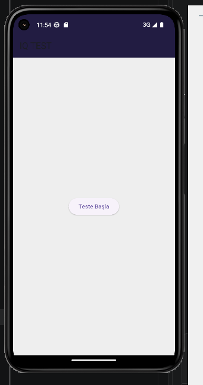
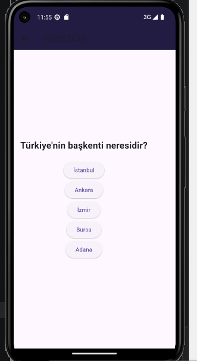
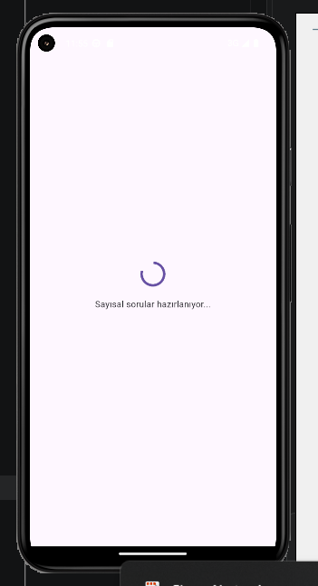
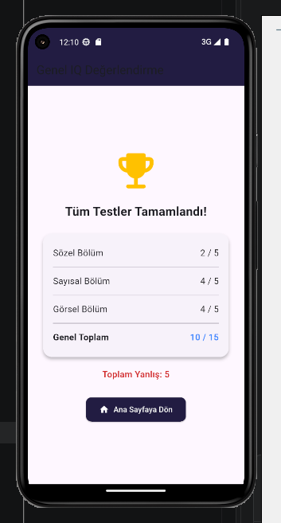

# Basic IQ & Quiz App (Flutter Starter Project)

Flutter ve Dart öğrenim sürecimde geliştirdiğim; temel durum yönetimi (`StatefulWidget`), ekranlar arası veri aktarımı ve basit quiz mantığını içeren **başlangıç seviyesi (starter/practice)** bir mobil uygulama çalışmasıdır.

---

## Proje Hakkında & Kapsam

Bu proje, Flutter'ın temel yapı taşlarını kavramak amacıyla hazırlanmış basit bir pratik projesidir. 

* 🔹 **Sözel, Sayısal ve Görsel** olmak üzere 3 temel test aşaması bulunur.
* 🔹 Sorular kategoriler arasında sırayla aktarılır ve doğru/yanlış sayıları hesaplanır.
* 🔹 En son ekranda her kategorinin skoru ve genel başarı oranı listelenir.
* 🔹 Harici görsel yükü olmaması adına geometrik semboller için Flutter'ın dahili ikon setleri (`Icons`) kullanılmıştır.

> **Not:** Bu proje ileri seviye mimariler yerine Flutter temellerini (Widget hiyerarşisi, Navigator rotaları, `setState` mantığı) pekiştirmek amacıyla yazılmış mütevazı bir pratik çalışmasıdır.

---

## Kullanılan Temel Yapılar

* **Framework:** Flutter SDK
* **Programlama Dili:** Dart
* **Durum Yönetimi (State):** Temel `setState`
* **Navigasyon:** `Navigator.pushReplacement` ile sayfalar arası skor parametresi aktarımı

---
---

## Uygulama Ekran Görüntüleri

## Uygulama Ekran Görüntüleri

| Sözel Bölüm | Sayısal Bölüm | Görsel Bölüm | Test Sonucu |
| :---: | :---: | :---: | :---: |
|  |  |  |  |
##  Çalıştırma

```bash
# Bağımlılıkları yükleyin
flutter pub get

# Uygulamayı başlatın
flutter run
